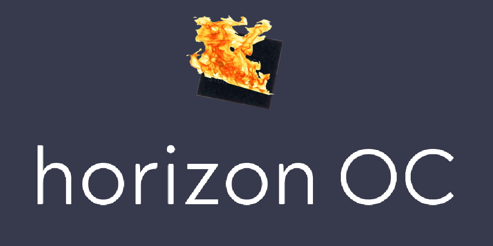

      

### DISCLAIMER: THIS TOOL CAN BE DANGEROUS IF MISUSED. PROCEED WITH CAUTION
* Due to the design of Horizon OS, overclocking RAM can cause **NAND DAMAGE**. Ensure to have a NAND Backup 

A open source overclocking tool for Nintendo Switch consoles running Atmosphere custom firmware 

## Features:
CPU overclock up to 2397MHz on Mariko units, 2091MHz on Erista units 
GPU up to 1305MHz on Mariko units, 998MHz on Erista units 
RAM up to 3200MHz on Mariko units, 2360MHz on Erista units 
Over/undervolting 
Configurator 
Works with most homebrew 

*Higher (potentially dangerous) frequencies are unlockable* 
*The exact maximum overclock varies per console* 
## Installation
Ensure you have the latest version of [Atmosphere](https://github.com/Atmosphere-NX/Atmosphere) and [Ultrahand](https://github.com/ppkantorski/Ultrahand-Overlay) installed before continuing 
Grab latest hoc.kip from releases tab 
If using hekate, edit hekate_ipl.ini to include "kip1=atmosphere/kips/*". No need for editing if using fusee 
Download latest Horizon OC sysmodule from releases tab 
Extract sysmodule into root of SD card 

Alternatively, you can download the configurator and click the two install buttons 

## Configuration
Download the latest configurator on your computer 
Run the file 
Select the drive your SD card or UMS device is mounted as 
Configure the kip to your liking, and in the end, save it 

## Building
Set up a development enviorment ready to compile Atmosphere 
Git clone Atmosphere, and move the cloned folder into build/ 
Insert Source/stratosphere folder into build/ 
Run build.sh

To build the configurator, clone it's repo (souldbminersmwc/ocs2-configurator) 
Run build.bat or cd into folder and run "python -m PyInstaller --onefile --add-data "assets;assets" --icon=assets/icon.ico --noconsole src/main.py" 

## Credits
meha for Switch-Oc-Suite 
sys-clk team for sys-clk 
b0rd2death for Ultrahand sys-clk fork 
Lightos and Sammybigio2011 for early testing 
